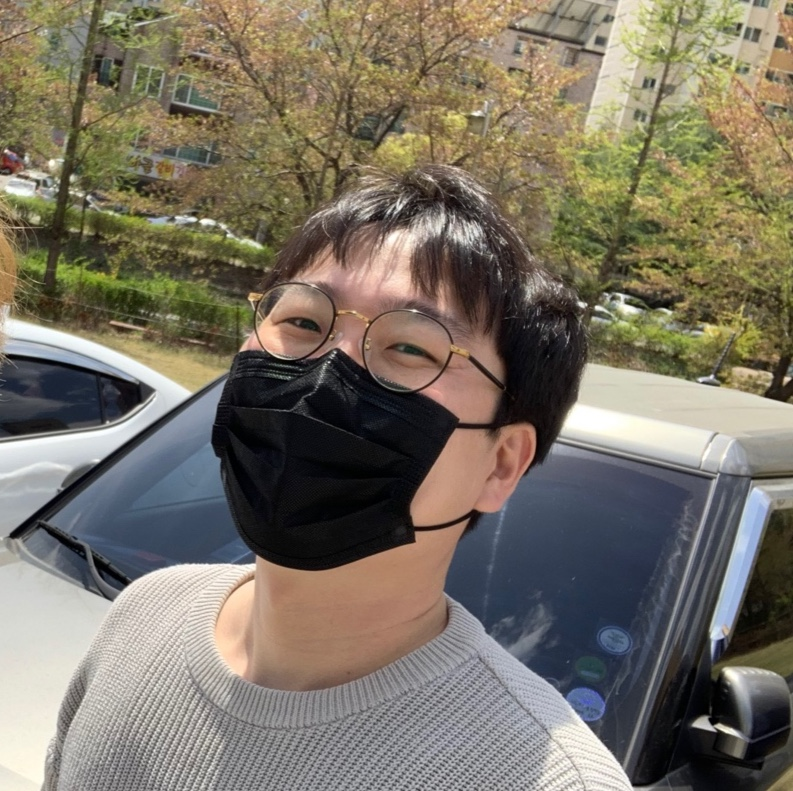

---
hide:
  - navigation
  - toc
---

{ width="30%"}

## ** Name **
---
Jongwon Lee

## ** Experiences **
---

- VIRNECT ( 2018.09 ~ )
    - AR developer
    - Team leader of Application team
- Teneleven ( 2017.09 ~ 2018.09 )
    - AR developer
- KAIST KI-ITC ARRC ( 2017.02 ~ 2018.09 )
    - Research Staff

## ** Skillset **
---
| Language   | Libraries    |    Tools  |    IDE        |
|   ---      |   ---        |    ---    |  ---          |
| C++        | OpenCV       | TeamCity  | Visual Studio |
| Java       | OpenMP       | CMake     | Clion         |
| Objective-C| OpenCL       | Github    | Android Studio|
| Javascript | NDK          | JIRA      | XCode         |
| Python     | Emscripten   | SonarQube |
| TypeScript | MKDocs       |  Unity3D  |
| C#         | Three.JS     | Slack     |

## ** Education **
---
- Computer Convergence of Chungnam National University

## ** Languages **
---
- Korean
- English
