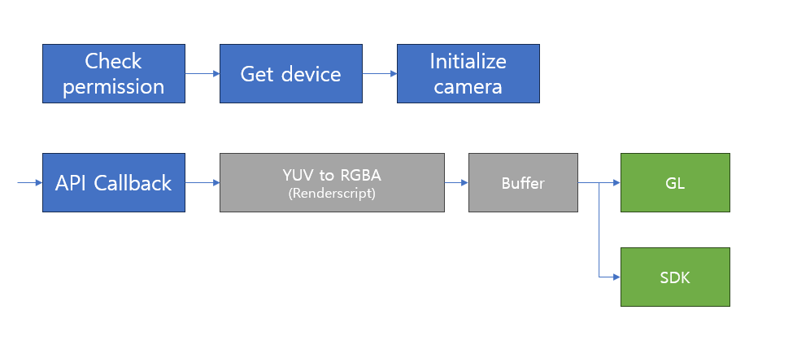
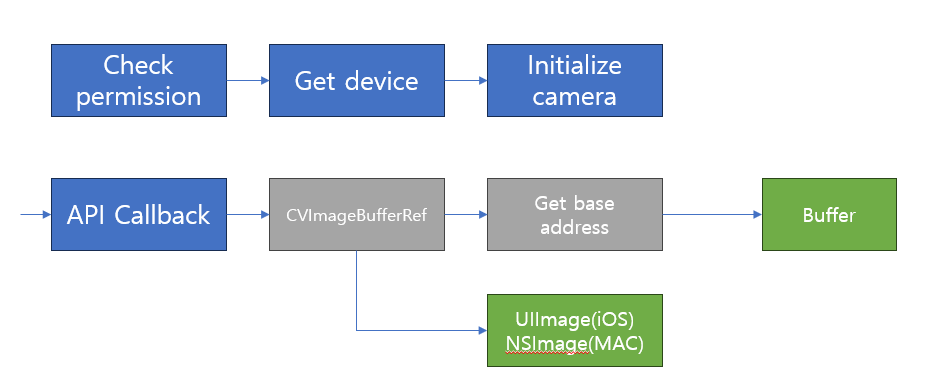
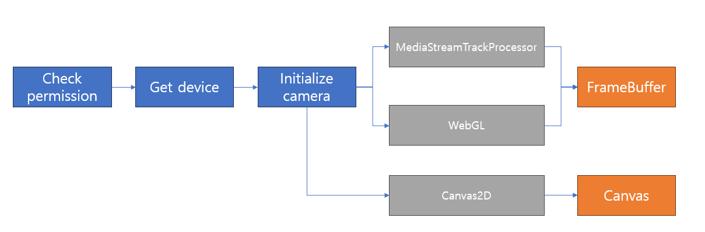

## Objective
---
Implement camera module that can access pixel data from C++ SDK

## Tools
---
### Android
- Android Studio
- RenderScript
- NDK

### iOS/MACOS
- Xcode

### Web
- Typescript
- VSCode
- EMscripten

## Feature
---
### Android
- Access camera using [Camera 2 API](https://developer.android.com/reference/android/hardware/camera2/package-summary)
- Convert color from YUV to RGBA or Gray
- Get pixel data in C++

### iOS/MACOS
- Access camera using AVCapture framework
- Grab pixel buffer from CVImageBufferRef
- Pass through to UIImage/NSImage for preview

### Web
- Open device camera (Android/ iOS/ Webcam)
- Grab frame pixel buffer
    - Use [MediaStreamTrackProcessor](https://developer.mozilla.org/en-US/docs/Web/API/MediaStreamTrackProcessor) if browser support
    - Use [WebGL](https://developer.mozilla.org/ko/docs/Web/API/WebGL_API/Tutorial/Getting_started_with_WebGL) and use ReadPixels

## Flow
---
### Android
{ width="100%"}
### iOS/MACOS
{ width="100%"}
### Web
{ width="100%"}