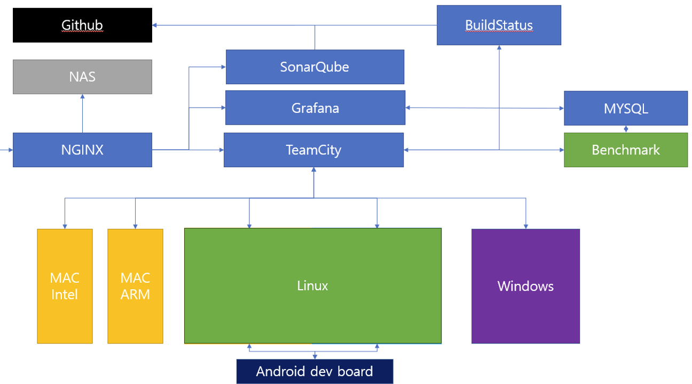

## Objective
---
Establish continuous integration system for SDK

## Tools
---
- TeamCity
- CMake
- Github
- NodeJS
- Docker
- Sonarqube
- Doxygen
- Grafana
- Clang-format
- Google Sanitizer
- NGINX

## Feature
---
- Repository build chaining
- Chanining in repository
- Mandatory tests
    - Comments
    - Code style
- Anlaysis
    - Dynamic analysis
    - Static analysis
- Cross-platform builds
- Unit tests on target platform
    - MAC
    - Android
    - Windows
    - Linux
- PullRequests
    - Publish build status
- Maintanence system using Docker

## Overview
---
{ width="100%"}