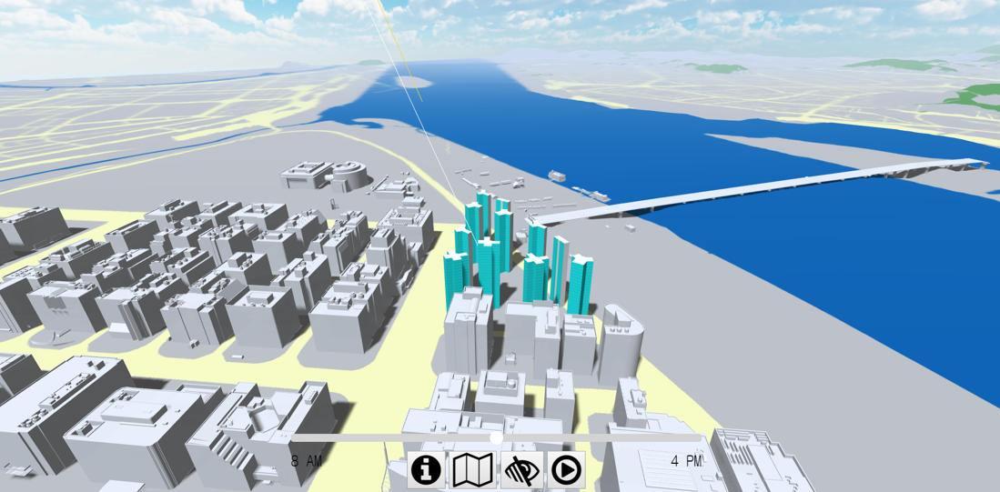
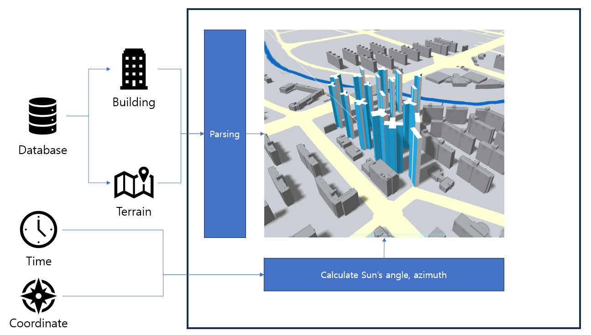

{ width="80%"}

## Objective
Visualize virtual city using WebGL

## Environment
  - VSCode
  - Three.JS
  - Javascript

## Feature
  - Fetch data from server
  - Create terrain and building mesh
  - Calculate real sun angle, azimuth for visualizing shadow at certain time
  
## Flow
{ width="100%"}