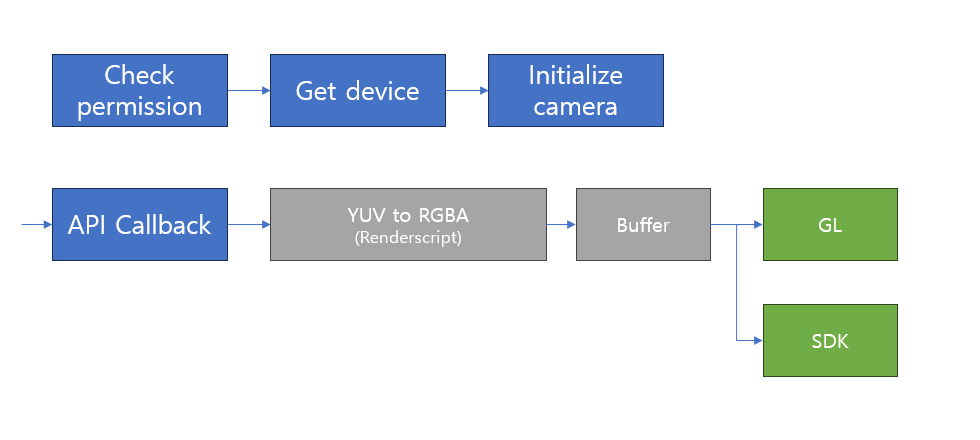

## Objective
---
Implement Unity3D camera module between C++ and C#

## Platforms
---
- Android
- PC

## Tools
---
### Common
- CMake

### Android
- Android Studio
- RenderScript
- NDK

## Feature
---
### Android
- Access camera using [Camera 2 API](https://developer.android.com/reference/android/hardware/camera2/package-summary)
- Convert color from YUV to RGBA or Gray
- Get pixel data in C++

### PC
- Open device camera (USB Camera)

## Flow
---
### Android
{ width="100%"}