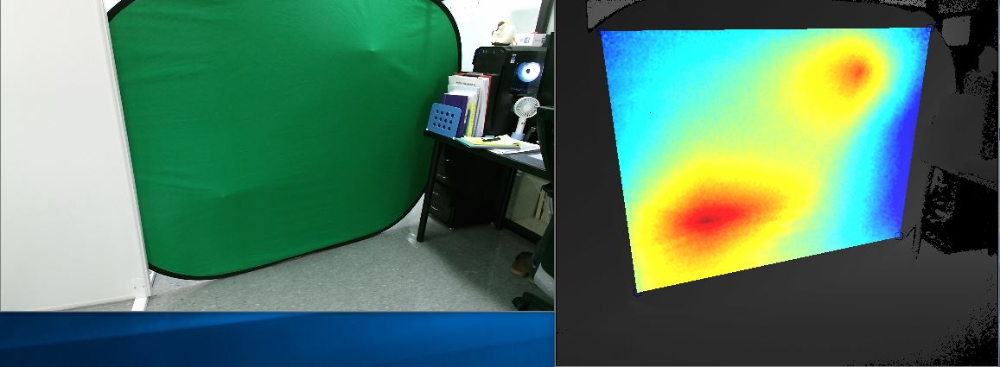
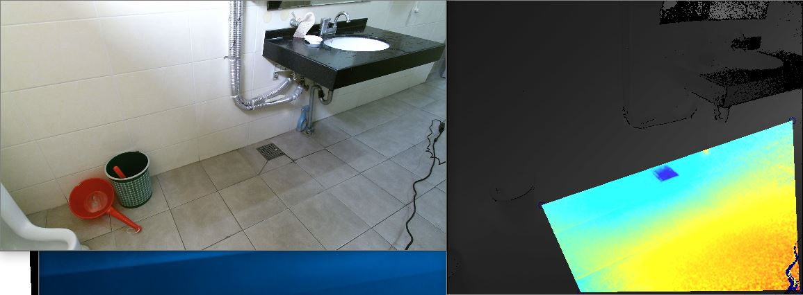

## Objective
---
Visualize difference of height in plane using Kinect and depth frame

## Tools
---
- VisualStudio
- Kinect
- OpenCV

## Feature
---
- Capture depth frame using Kinect
- Estimate the heights with equations of planes
- Visualize heatmap of differences

## Result
---
{ width="100%"}
{ width="100%"}