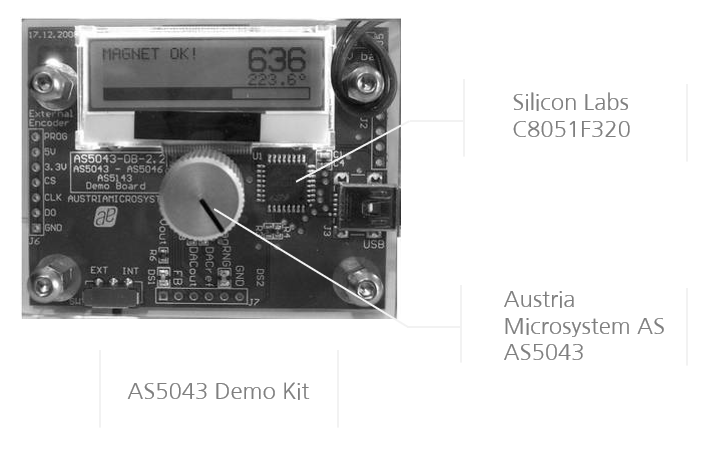
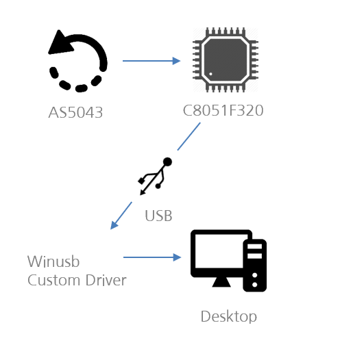

## Objective
Send rotation value to desktop using magnetic rotate sensor. 
This project applied to Kiosk system

## Environment

### Devices
{ width="80%"}

- Austria Microsystem AS's AS5043 Dev board
- Debugger

### Skill
- C
- C++
- C#
- Unity3D
- Winusb custom driver

## System
{ width="80%"}

## How to do
1. AS5043 Dev board does not contain a feature that can send its rotation data via USB.
2. Modify firmware using Debugger and read all the datasheet of AS5043 and C8051F320 in order to send rotation value though USB
3. Make custom USB driver in Windows for enrolling device into Windows
4. Make library for accessing device in Windows using C++
5. Make Unity3D project and implement C# script that can import C++ library and access its functions
6. Sync between Unity3D's vitual camera and AS5043

## Reference
- [AS5043 Datasheet](https://ams.com/documents/20143/36005/AS5043_DS000378_2-00.pdf/4e598160-4078-f978-bfb8-8ba2d6aabd8b)
- [C8051F320](https://www.silabs.com/documents/public/data-sheets/C8051F32x.pdf)