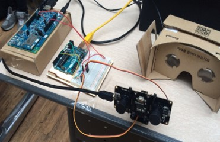
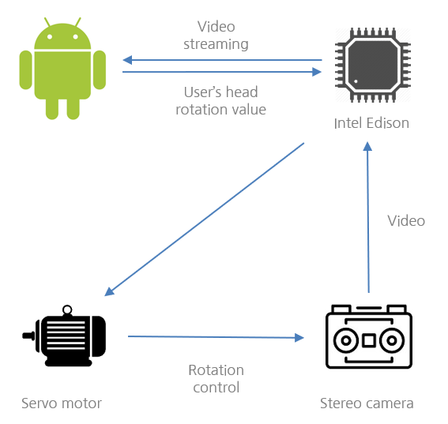
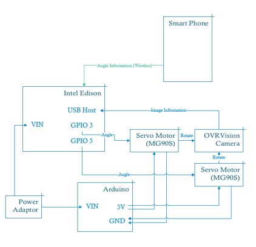

{ width="80%"}

## Objective
Developing intuitive drone’s camera module using Head Mounted Display, Android is this project’s objective

## Environment

### Devices
- OVR Vision camera
- Arduino (Power supply for motors)
- Intel Edision (Main processor)
- Google Cardboard
- Android
- MG90S servo motor

### Skill
- C++
- Java
- MRAA (GPIO control)
- MJPEG-Streamer (Streamming video)

## System
{ width="80%"}

{ width="80%"}

## Video
Music is loud so be careful

## Awards
- Selected as exhibition team in Google's Hackfair
- General Scholarship Competition Special prize
- Idea Comptetition Excellence award