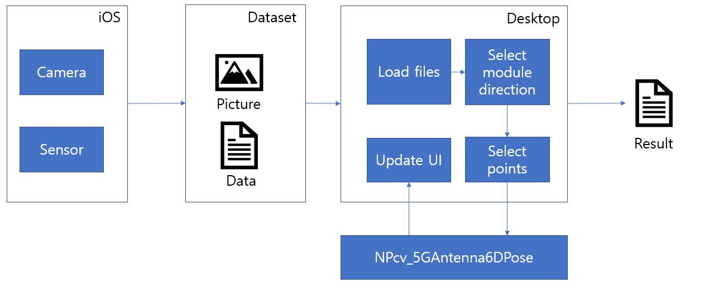
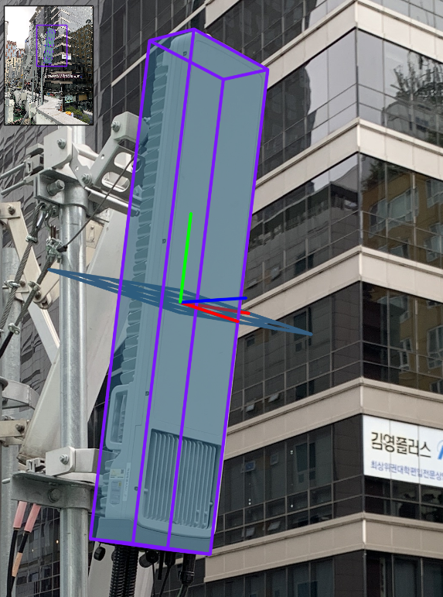
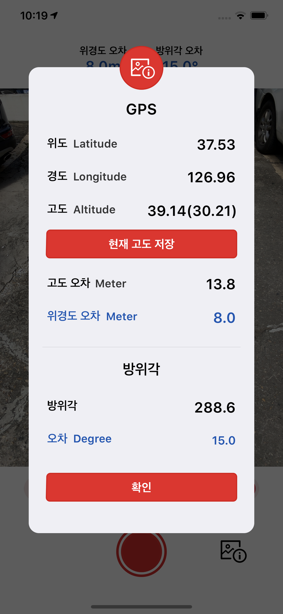

## Objective
---
- Capture frame and sensor data on mobile
- Calculate target pose and visualize the result on PC application

## Tools
---
- VisualStudio
- WPF
- iOS
- Xcode
- OpenCV

## Feature
---
- Capture camera frame and sesnsor data with iOS device
- Load data from iOS on PC application
- Draw target boundary and calculate target pose
- Visualize estimated pose into target

## Flow
---
{ width="100%"}

## Result
---
{ width="70%"}
{ width="50%"}