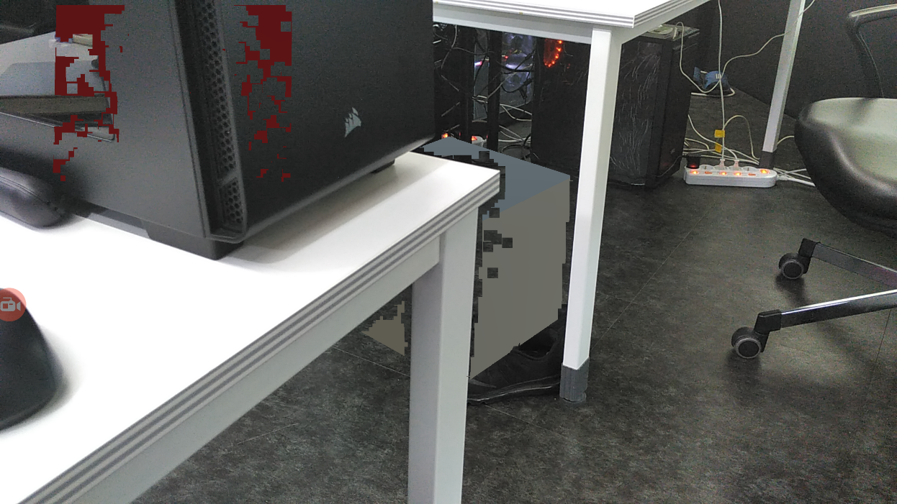

{ width="80%"}

## Objective
Apply occlusion rendering with Google Tango device which has depth camera. 

## How to do

Joint Bilateral Filter, Median Filter, Guided Filter

## Environment

### Devices
- Android
- Google Tango

### Skill
- Java
- C++
- OpenCL
- OpenCV
- NDK
- Unity3D

## Flow
{ width="100%"}

## Result
Occlusion rendering with default Tango SDK
{ width="80%"}

Occlusion rendering with our method
{ width="80%"}
{ width="80%"}
