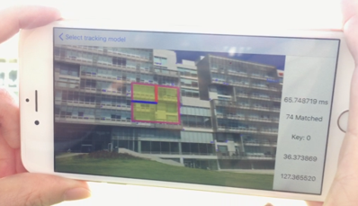

{ width="80%"}

## Objective
Applying C++, OpenCV based object tracking module to mobile devices and optimized it

## How to do

Use OpenCV and NDK for android.
In order to optimize, use GPU and Threads
For CUDA, use Tegra and NVIDIA’s Codeworks for android
Use OpenCL in OpenCV’s T-API and wrote OpenCL kernel codes
For iOS, use Xcode but couldn’t use OpenCL

## Environment

### Devices
- Android
- iOS

### Skill
- Java
- Objective-c
- C++
- OpenCL
- OpenCV
- NDK

## System
