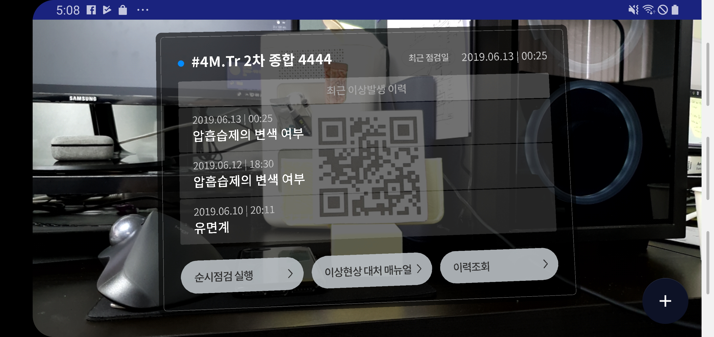

## Objective
---
Implement AR maintenance application with Unity3D

## Platforms
---
- Android

## Tools
---
- Android Studio
- Unity3D
- NDK
- ARCore

## Feature
---
- Use custom Aruco detector(C++) using NDK
- Import AAR for using Aruco detector on Unity3D
- Initialize ARCore and give frame for detecting
- Make an anchor on marker using detector result and visualize panel on it
- Tracking device pose with ARCore
- Import Unity3D activity on Android Studio

## Result
---
{ width="100%"}