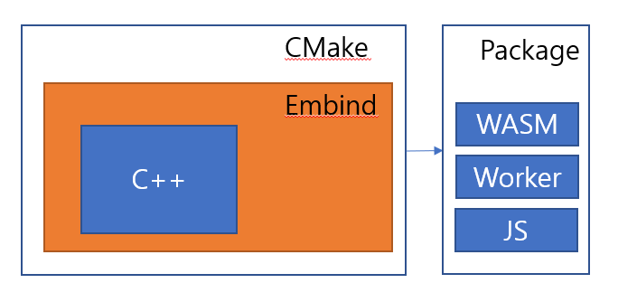

## Goal
---
C++로 짜여진 모듈을 Emscripten과 CMake를 이용하여 WebAssembly로 변환

## Output
---
* WASM
* Interface 역활의 Javascript
* Threading을 담당하는 Worker

## Tools
---
{ width="200" }
{ width="200" }

## Flow
---
{ width="100%"}

## 