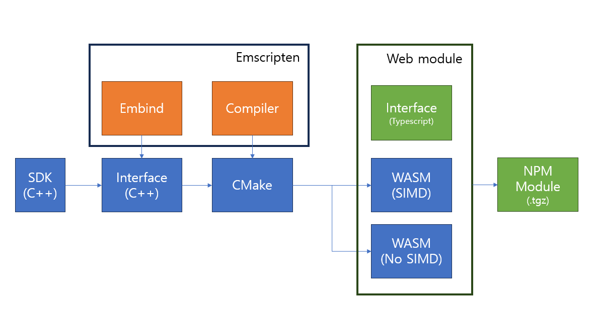

## Goal
---
Make Webassembly module using Emscripten, CMake 

## Output
---
- WASM
- Javascript file for interfacing
- Javascript file for threading
- NPM Module

## Tools
---
- Emscripten
    - Embind
- CMake
- Clion

## Feature

- C++ interface using [Embind](https://emscripten.org/docs/porting/connecting_cpp_and_javascript/embind.html)
- SIMD/None SIMD version compile
  - SIMD for latest version of browser
  - None SIMD for Safari (under 15.4) or browser that does not support SIMD feature
- Interface for Typescript
- Wrapping it into NPM module that can be imported by other application

## Flow
---
{ width="100%"}